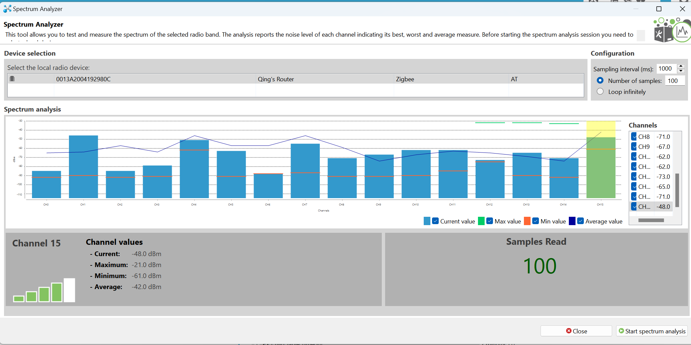
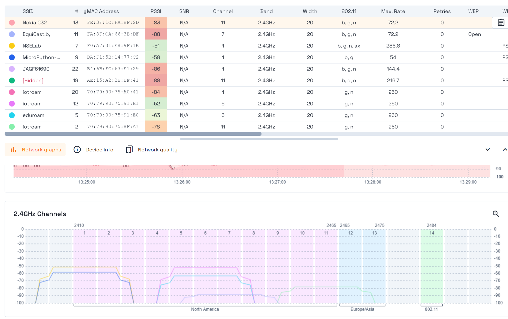
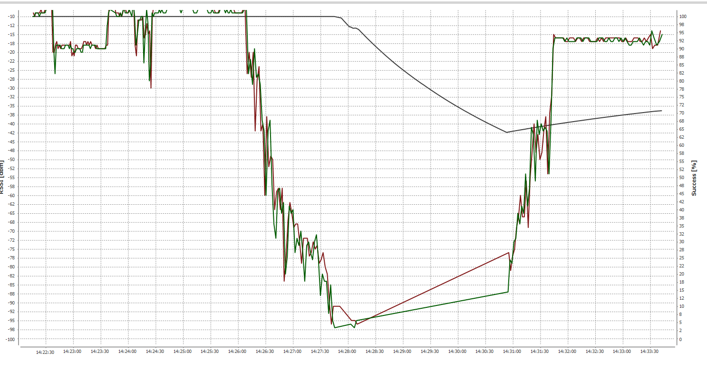

# Practicum 2 - Communicatie protocollen
## Qing Scholten (20208294)
---
1. Alleen hetgeen gezonden zou moeten worden.
2. Zowel hetgeen gezonden zou moeten worden als hetgeen ontvangen is van de ZED of ZC. Dit komt omdat de ZED wakker is.
3. ZED zowel wat gezonden zou moeten worden als wat ontvangen zou moeten worden. ZC enkel wat gezonden zou moeten worden. Dit komt omdat de sleeptime van de ZC 28 seconden is, wat de buffering time is en aangezien de ZED binnen de 28 seconden aangezet is komt het bericht binnen. De ZED is in slaap dus transmit niks.
4. ST = wake time
5. Omdat de SP op de ZC op 320 ms staat terwijl de ZED enkel een keer in de 10 seconden aankomt. Door de SP op de ZC aan te passen naar 10 seconden of hoger, komt het bericht wel aan. Door de SP op de ZED naar kleiner te zetten dan de ZC komt het bericht ook aan.
6. XCTU Channel 7 (Zigbee kanaal 18) en Channel 15 (Zigbee kanaal 26). 
7. XCTU Channel 7/Zigbee kanaal 18 want minste ruis en hoogste avarage.

8.

   a) 0x0E

   b) atch
   
9.

    a) 13 dbm en 19.95 mW

    b) atpp

    c) -5 dbm (0,32 mW), -1 dbm (0.79 mW), 2 dbm (1.58 mW), 5 dbm (3.16 mW) en 8 dbm (6.31 mW)

10. 3200 m
11. atpl 0
12. 7FFF
13. 8080
14. 8080  
15. 

a) -19 dbm en -19 dbm

b) -10 dbm en -10 dbm

c) Als de antennes beide omhoog staan is de meetwaarde hoger. Zodra er een naar beneden staat is de RSSI waarde lager.

d) Omhoog

16. Lokaal 2069 -95 dbm
17. 

18. Die zet je lager om batterij te besparen.